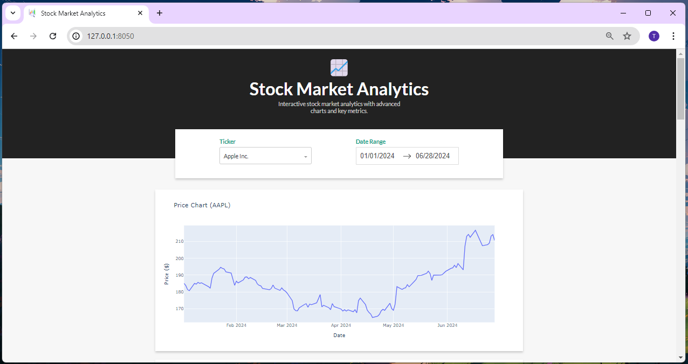

# Stock Market Analytics Dashboard

This project implements an interactive dashboard using Dash to visualize stock market data for a selection of companies. It provides various charts such as price trends, volume, candlestick charts, OHLC bars, profit margins, P/E ratios, Bollinger Bands, and MACD indicators.

## Features

- **Price Chart:** Displays adjusted close prices over a selected date range.
- **Volume Chart:** Shows trading volume trends for the selected stock.
- **Candlestick Chart:** Visualizes daily price movements (open, high, low, close).
- **OHLC Bars:** Displays open, high, low, close prices in a bar format.
- **Profit Margin Indicator:** Calculates and displays the profit margin percentage.
- **P/E Ratio Indicator:** Shows the price-to-earnings ratio based on the latest available data.
- **Bollinger Bands:** Visualizes volatility and price levels relative to moving averages.
- **MACD (Moving Average Convergence Divergence):** Shows MACD and signal line trends.

## Technologies Used

- **Python Libraries:** Pandas, yfinance, Dash, Plotly (graph_objects).
- **CSS:** Used for custom styling of the dashboard components.
- **Google Fonts:** Lato font family for consistent typography.

## Installation

1. Clone the repository:

```bash
git clone https://github.com/Tharanitharan-M/Stock-Market-Analytics-Dashboard
```

2. Install the required Python packages:

```bash
pip install pandas yfinance dash plotly
```

3. Run the application:

```bash
python app.py
```

4. Open your web browser and go to `http://127.0.0.1:8050/` to view the dashboard.

## Application Screenshots

### Dashboard View



### Charts


## Usage

- Select a company from the dropdown menu to view its stock data.
- Choose a date range using the date picker to analyze trends over time.
- Explore different charts by navigating through the tabs.

## License

This project is licensed under the MIT License - see the [LICENSE](LICENSE) file for details.
